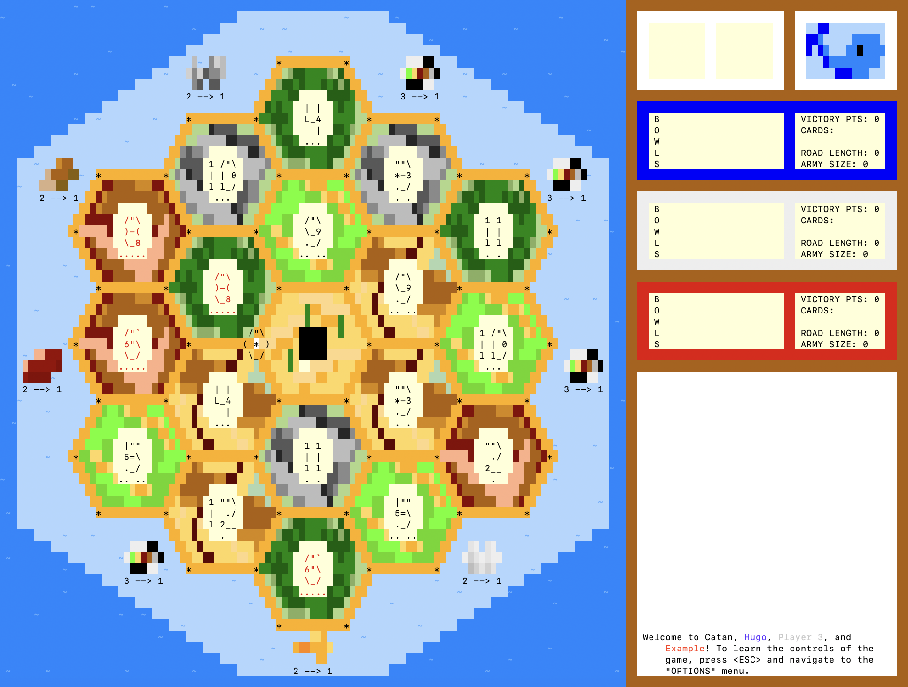

# Project Description

Welcome to Catan! This is a project I made during February/March in 2024 intending to make an easy-to-use terminal-based version of the popular board game Catan.

The main directory contains these things:  
 - `app.sh`: The bash script to compile and run the Java code.
 - `debug-messages.txt`: Where error messages get sent. Hopefully should be irrelevant if you download this repo to play on your own (fingers crossed).
 - `README.md`: This file.
 - `class`: Contains the compiled Java code.
 - `data`: Contains the text files that describe the images used in the game.
 - `src`: Contains the Java files that run the game.
 - `img`: Contains images for this file. Not necessary for the functionality of the game.

# Getting Started

To run the app, first download the repository by either downloading it as a zip file or running `git clone https://github.com/HugoIngelsson/Catan` in the file location you want it downloaded. Then, enter the `Catan` directory using the terminal and run the command `bash app.sh`. The game should then run as inteded, at which point you should go to the Controls subheading in this file to learn how to navigate the game. If it doesn't work at this point, look at the Potential Issues subheading.

# Potential Issues

The most common issue I've encountered is the terminal window being unable to fit all the pixels on screen, leading it to run into an error when printing. The way to fix this is to do `<CMD>`+`-`, which will shrink the text and allow the entire window to fit on your screen.

There aren't many other issues I've faced, though I expect there may be some if you're not using macOS. I tested running the program on an Ubuntu Virtual Machine as well and it seemed to work after some slight changes, though I have no clue what a Windows machine will do with the program, if it's even able to run.

# Controls

Here is a summary of the controls you'll need to play the game:
 - `ARROW KEYS`: How to navigate every menu and move the cursor on the screen. Should be pretty intuitive.
 - `SPACE`: How to interact with different screen elements. The button you'll press with space will almost always be highlighted in a golden color.
 - `R`: Roll the dice (when possible).
 - `ENTER`: Pass turn to the next player (only works when not in another menu and after rolling the dice).
 - `TAB`: Shift into or out of "road building mode" after rolling the dice and not in a menu.
 - `D`: Open the development card menu.
 - `A`: Buy a development card.
 - `T`: Open the trade menu.

I also have a section in this README file that goes deeper into how the game is played ("Further Game Details"). If you're confused on any of these controls, go there to gain further insight.

# Future Additions

Though the main game of Catan is completely done, there are a couple of things I'd like to add if I ever have time (if you're reading this years after I made this and none of these things got done... well, I guess I never had time).

On the top of my list are:
 - Make the other buttons in the menu selection actually do something. Right now there's `New Game`, `Options`, and `Rules`, but only the first of the three actually do something. I suppose this file serves as a sort of substitute for the other two, but it'd be nice if learning how to play the game could be self-contained within the game itself. As a temporary fix, I could add simple GUIs to each that only have text on them for each, but eventually being able to change the controls and having some kind of nice graphics for the rule book could be a nice thing to include.
 - Comment all of my code. I made the mistake of simply blazing through the coding without caring to add explanations to code blocks. It worked for me since the project was contained within about a month of production, but if I ever return that make things really difficult.
 - Add multiplayer on local networks. Pretty self-explanatory: make the game playable online by having some kind of lobby/hosting feature. Included in this would be having someone act as the central server that keeps track of the entire game state with other players simply sending messages to that server when trying to do things. This would solve the issue of players being able to see exactly what resources and development cards each other have, though I'd imagine it'd take a large amount of work to implement.
 - Create an API for bots and allow players to play against NPCs. This allows players to play alone or with fewer players and could also allow someone like you (the person reading this) to make your own bots.

# Further Game Details

Really, this is just an excuse for me to show more images of the game. I really put a lot of effort into making the game look beautiful despite being contained within the terminal, and I think that effort shows.

### Starting a Game

It's relatively easy to start a game. Pressing any button while in the start screen opens up a GUI to start a game, which looks like this: 

There are a few options here. The first, "NEW GAME", is for starting a regular game. This is probably the button you want to select (which you can do by pressing `SPACE`). 

Alternatively, you can play in "climate mode", which is a gamemode I created for a class I had in college which adds a couple of new features, such as rising sea levels and strained resources. I think it adds an interesting twist, but it's probably not as balanced as a regular game of Catan is since it hasn't has as extensive of testing. You can navigate to this choice by hitting the `DOWN` arrow.

Finally, there's the options button, which does nothing (and truthfully probably never will), but it makes the menu look nice and complete :)

Once you select "NEW GAME" (or "CLIMATE"), a menu like this will pop up:

Here you can select how many players there are, what their names and colors should be, and how many victory points you need to win. Navigating this menu takes a slight amount of finagling since there's no mouse interaction in the game.

In particular, you can move horizontally between elements using `TAB` and vertically using the `UP/DOWN` arrow keys. You change colors by using the `LEFT/RIGHT` arrow keys while on a player, noting that you can't have duplicate colors. Add a player by pressing `SPACE` while hovering over a big plus button and remove a player by pressing `ENTER` while they're selected. Finally, any other button you press gets added to the currently selected player's name (and you can remove letters by hitting `DELETE`). Once all players are added, select `DONE` to play the game.

### Gameplay

Once you start a game, you should see something like this (with an additional thermometer if you're playing in climate mode):

Players get two settlements and two roads for free at the start, which they get to place in a snake-draft in the order of colors at the right side of the screen.

You can build a settlement on any lattice that has a star (which is anywhere that isn't right next to another settlement), and building one takes one of every resource except ore (unless it's one of your first two, in which case it's free). To build one, hover over any suitable location using the cursor and press `SPACE`.

Additionally, you can upgrade a settlement into a city by hovering over it and pressing `SPACE`. This costs two ore and three wheat. Cities are great because they are worth twice as many victory points and give twice as many resources.

To build a road, you have to be in road-building mode, which you can enter by pressing `TAB`. Building a road takes one wood and one brick, and you press `SPACE` to build it. It looks like this when you're in the process of building one:

Catan requires resource management, and in this version of the game the resources are color-coded and given aliases on the right side of the screen. For reference, this is what it looks like:

`B` stands for "brick" and is a brownish-red color. Bricks are used for building roads and settlements, and there are only three brick locations on a standard game of Catan.

`O` stands for "ore" and is a light gray color. It's used for development cards and cities, and also only has three map locations alongside bricks (while all other resources appear four times on the map).

`W` stands for "wheat" and is a pale yellow color. It's used for settlements, cities, and development cards.

`L` stands for "logs", which is wood (but I could't reuse W twice without it being confusing). It's a brown color and is used for exactly the same purpose as bricks, but it's typically more plentiful.

`S` stands for "sheep" and is a light green color. It's used for settlements and development cards.

Each turn, a player starts their turn by pressing `R` to roll the two dice. Any player that has a building around a resource whose number is the sum of the dice gets resources. In the above image, for example, any resource marked with a six would produce resources.

If a player rolls a seven, they trigger the robber. This causes two things to happen:

<ol>
  <li>Any player with more than seven resources in hand gets "robbed" and chooses half of their resources to discard (rounded up).</li>

  <li>The player who rolled gets to place the robber wherever they want, blocking the tile where the robber is placed from producing any resources and stealing a random card from a player that has a building on that tile. This happens using the robber cursor, which looks like this:</li>
</ol>

### Development Cards

Development cards have powerful effects that can help a player win the game. Players can buy development cards for one sheep, wood, and ore each by pressing `A` on their turn.

To use a development card, a player should press `D` and navigate to the card they want to use. Note that a development card cannot be used on the turn it was bought, and victory point cards cannot be played (but rather stay in your hand until the game ends).

There are five kinds of development cards:

`KNIGHT:` This card lets you move the robber (as if you rolled a seven, but without causing players to lose resources for having too many cards). After having played three knight cards, you get the "largest army bonus", which is worth 2 victory points; after that point, the largest army bonus is held by whoever has played the most knights during the course of the game.

`VICTORY POINT:` There are 5 victory point cards in the deck, each given a different name (such as "Great Hall" like below). Each one of these is worth 1 victory point and cannot be played.

`ROAD BUILDING:` This card lets you build two roads for free, great for building the longest road or competing with another player to build a settlement first.

`YEAR OF PLENTY:` This cards gives you two resources you choose, especially good when you're in need of a single resource in particular.

`MONOPOLY:` Playing this card gives you all of the resources of your choice currently in play. This is great for when you know there are a bunch of resources in play and you have the ability to trade with them, or perhaps when there's a single resource you need and you know another player has it.

### Other Rules

#### Trading

You can trade with other players and with the bank. 

Typically, trading with the bank requires a 4-to-1 ratio of resources (where all 4 are the same kind), but this can be reduced with trading ports. There are free trade ports, which give you 3-to-1 deals with the bank for all resources and specialized ports, which give you 2-to-1 deals but only for a single resource.

For example, here player red has access to a 2-to-1 trade for sheep, which means they can give 2 sheep in exchange for any 1 other resources:

To initiate a trade, all a player has to do is press `T`. This brings them to the following menu:

The left side represents what you're offering and the right side represents what you'll get. When you're done setting up the trade, press the arrow below. If it's a trade that can happen with the bank automatically, it will simply happen.

If not, this following step will show up:

Players can then accept the trade by pressing keyboard buttons `1` through `3` in the order their colors appear. For example, above the button `2` was pressed to indicate that the blue player wants to accept the trade. Then the player who initiated the trade can hover the cursor over a player who accepted and press `SPACE` to complete the deal (or press `ESCAPE` to back out).

#### Longest Road

Whoever has the longest unconnected chain of roads gets an additional two victory points (as long as it's of at least length 5). Tie-breaks happen by whoever had the longer road first.

The way the length is calculated might be a bit confusing, but the basic idea is this: the longest road is the longest path traveling from one point to another without repeating roads and without crossing other players' buildings. 

### Game End

Finally, once a player has reached the amount of victory points determined at the start and ends their turn (by pressing `ENTER`), they win the game.

In the "climate change" game mode, the game can also end by filling up the thermometer bar (in which case everyone loses).